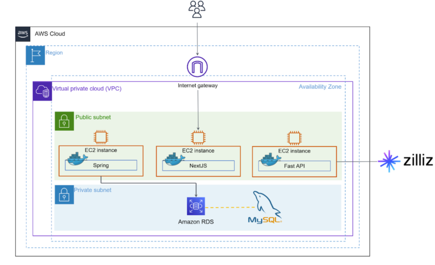
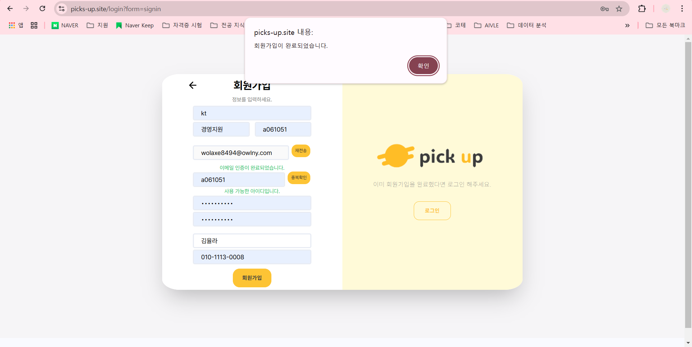
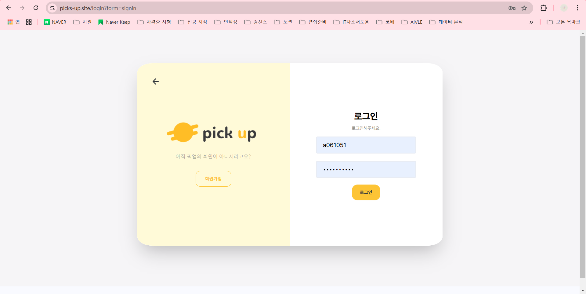
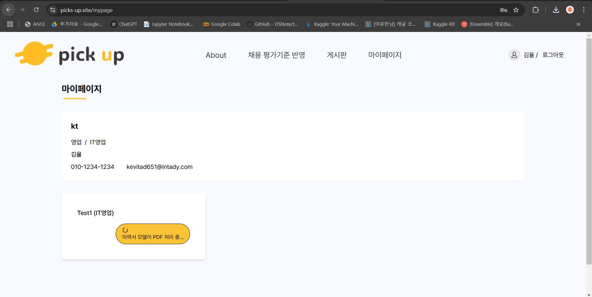
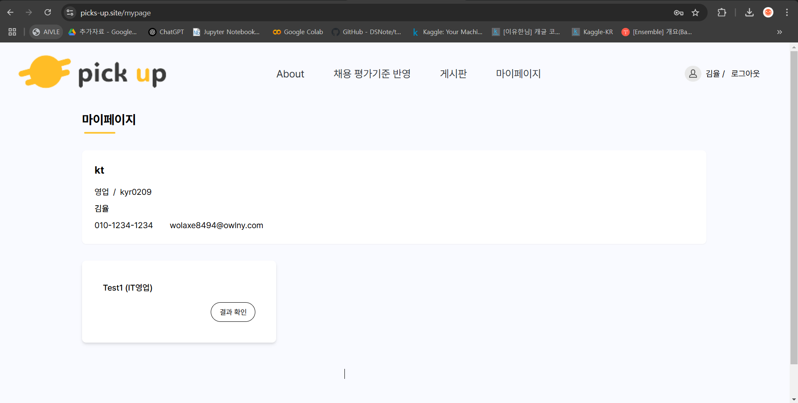
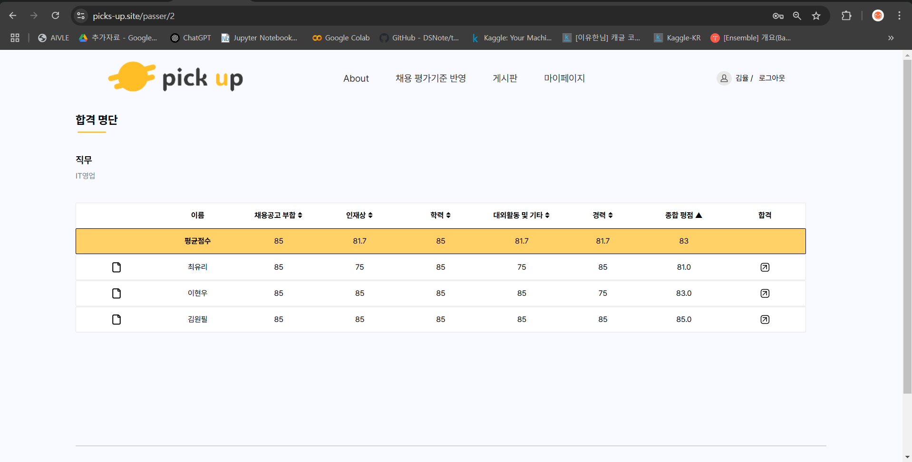

# 기업의 채용 어시스턴트 PICK UP 

## 📌 프로젝트 소개
> KT AIVLE School 6기 빅 프로젝트 - 채용 어시스턴트 PICK UP
>
> 개발 기간 : 2024.12.30 ~ 2025.02.17

#### 💡 PICK UP 기획 배경
- 현재 기업에서는 채용 프로세스에서 수천 명의 지원자를 관리하며 서류 검토, 일정 조율 등 높은 업무 부담이 발생합니다.
- 또한, 평가 기준이 통일되지 않아 지원자 개개인의 역량을 객관적으로 수치화하기 어렵다는 단점이 있습니다.
- 현재 시스템을 보면 직무 적합성 평가에 많은 시간이 소요되고 채용 데이터 분석의 한계가 있기 때문에 우수한 인재가 이탈할 위험이 발생합니다.
- 이러한 상황을 개선하고자, 기업의 채용 프로세스를 쾌적하고 효율적으로 만드는 것을 목표로 채용 어시스턴트 'PICK UP'을 기획하게 되었습니다.

#### 🔐 회원가입 시 인증 수단과 다양한 정보 입력
PICK UP은 회원가입 시, 회사 이메일 인증을 통해 보안을 강화하고, 같은 회사 사람들끼리만 공유할 수 있는 게시판 커뮤니티를 제공합니다.
- 회원가입 / 로그인
    - 이메일 인증으로 인한 본인 확인 기능을 추가했습니다.
    - 회원가입과 로그인 패널 간의 전환은 자연스럽도록 구성했습니다.
- 게시판
    - 같은 회사의 사람들끼리만 게시판의 내용을 볼 수 있도록 설정했습니다.

#### 💬 평가항목 입력 별 평가 점수 및 분석 제공 & 서류 합격자의 이력서를 토대로 면접 질문 생성
PICK UP은 기업의 직무 별 평가항목을 입력하고, 그에 따른 평가 점수를 부여해 서류 검토 시 채용 프로세스를 효율적인 경험을 제공합니다.
- 이력서 등록 / 결과 페이지
    - (aI 쪽이 모델 관련 이야기 언급 좀 해줘)
- 합격자 페이지
    - (여기도 면접 질문 관련 모델 이야기 언급 좀 해줘)

 

## 🧑 팀 구성
| [**강해찬**](https://github.com/ChaneHaDa) | [**최찬**](https://github.com/imchanchan) | [**박수민**](https://github.com/sueminPark) | [**유창현**](https://github.com/spaceOfSoul) | [**김성호**](https://github.com/sungho255) | [**김유라**](https://github.com/kimyura29) | [**심용훈**](https://github.com/yonghoon98) |
| :------: |  :------: | :------: | :------: | :------: | :------: | :------: |
| | |  |  |  |  |  |
| Leader, BE | BE | FE | FE | AI | AI | AI |
| RESTful api 구현 및 문서화   DB 구성   AWS 배포 | JWT 로그인 및 회원가입 구현   게시판 CRUD   spring security   REST api 구현 및 문서화 | 전역 상태 관리   회원가입, 로그인, 이력서 입력 및 결과   페이지 구현   게시판 CRUD   관련 api 통신 구현 | 메인 및 튜토리얼 페이지, pdf 모달, 평가 분석표 구현   관련 api 구현 | ERD 설계 및 모델 api 작성 (Fast API)  langgraph 구현   RAG 구축  vectorDB 생성 및 연결 | 데이터 제작  프롬프트 엔지니어링 langgraph 구현 RAG 구축 | erd 설계 및 데이터 제작  vectorDB   유지 보수   모델 및 vectorDB   api 작성   langgraph 구현 |

 
 

## 🛠️ 기술 스택

**Front**
 

**Back**
 

**Database**
 

**Environment**
 

**Cooperation**
 

 

## 🌐 website
[PICK UP 웹사이트 바로가기](https://picks-up.site/)

 

## 🎨 아키텍처

 

## 💡 주요 기능
|    회원가입 & 로그인    |
| :--------------: |
|   |
| - 회원가입 시, 이메일 인증을 통한 본인 확인 - 회사명, 직무, 부서 등을 입력하여 회원가입 가능 |

 

| 마이페이지 |
| :--------------: |
|   |
|   |
| - 나의 정보 : 회원가입 시 입력했던 정보 확인 가능  - 분석 및 평가 : 채용 담당자 본인이 등록한 공고에 대한 분석과 평가를 진행 |

 

| 이력서 분석 및 평가 페이지 |
| :--------------: |
|   |
| - 이력서 업로드 : 지원자들의 이력서 파일을 업로드  - 평가 항목 입력 : 채용 공고에 대한 평가 항목 기준을 입력하여 평가 점수를 도출할 항목에 대한 자세한 내용 작성 가능 |

 

| 분석 결과 페이지 |
| :--------------: |
| <mg src="big-project-front/public/images/분석결과.png" width="200">  |
| - 본인이 입력한 평가 항목 요소들과 직무 확인 가능  - 지원자 수 통계와 평가 점수 평균 확인 가능   지원자들의 평가 기준 별 평가 점수와 지원자 합격 여부 결정 가능 |

 

| 힙격자 명단 및 상세 페이지 |
| :--------------: |
|    |
| - 합격자 명단 : 평점 및 개인의 평가 항목 별 분석 내용 확인 가능  - 면접 질문 : AI 모델을 통해 개인의 이력서를 분석해 개인별 맞춤 면접 질문을 생성 |

 

| 게시판 |
| :--------------: |
|   |
|   |
| - 사내 커뮤니티 게시판으로 공지 및 글, 댓글 crud 가능 - 글 작성 : 본인 글만 수정 및 삭제 가능 - 댓글 작성 : 본인 댓글만 수정 및 삭제 가능  |

 
